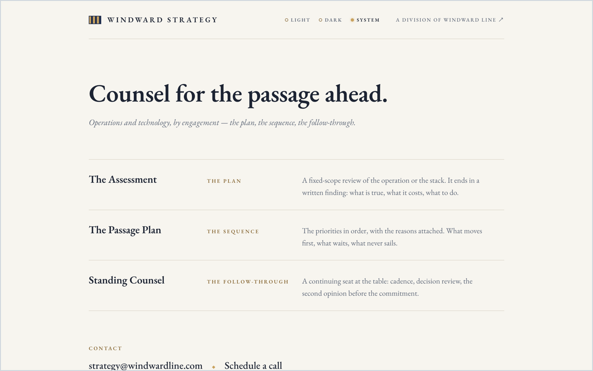

# strategy.windwardline.com

Windward Strategy, the advisory division of Windward Line. Operations and
technology, by engagement: the plan, the sequence, the follow-through.

Static site, no build step: two HTML pages (the chart room and `/schedule`,
which embeds the division's Koalendar booking page), one stylesheet,
self-hosted EB Garamond, the division signal flag (Golf — "I require a
pilot") as inline SVG, and the lamp (light / dark / system). Design
spec: [docs/superpowers/specs/2026-07-27-strategy-chart-room-design.md](docs/superpowers/specs/2026-07-27-strategy-chart-room-design.md).

Deployed on Vercel; DNS on Cloudflare. Pushes to `main` deploy to production.
Security headers are set in [vercel.json](vercel.json).

The site is proprietary; see [LICENSE](LICENSE). The fonts are not. EB
Garamond ships under the SIL Open Font License 1.1, and its notice travels
with the files in [fonts/OFL.txt](fonts/OFL.txt).
